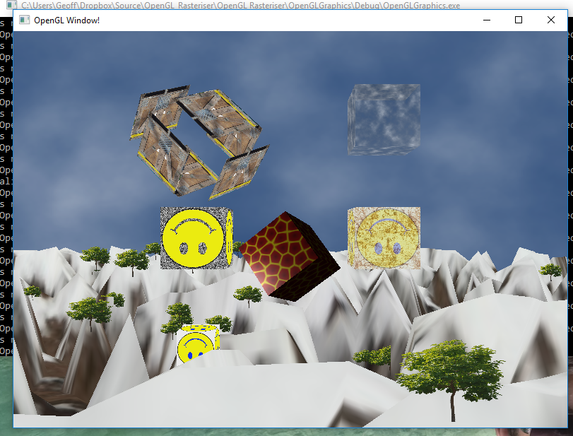

# Software Rasteriser

Hardware rasteriser with a scene demonstrating use of primitives, models, meshes, interpolated colours, transparency, translations, textures, phong lighting, and shaders. Extended from NCLGL frameowork created by Rich Davidson (Newcastle University). Main focus of this project was to learn about shaders.

Examples:

Ground: Tesselated and textured snowy landscape.

Cube 1: Uses shader to cause the sides of the cube to explode outwards and back in again whilst rotating. 
Cube 2: Uses a shader that causes the cube alpha value to rise and fall causing it to dissapear and re-appear. 
Cube 3: Uses a shader that moves the cube up and down. The smily face on the cube moves with the cube whilst the noise background is stationary. 
Cube 4: Uses a shader to spin the textured lava cube. Uses phong lighting. 
Cube 5: Shader that moves the cube up and down whilst interpolating between a smiley texture and a rust texture. 
Cube 6: Uses shader to make the cube shrink and disapear.

Trees: Geometry Shader is used to turn scattered points into quads and applies tree texture.

## Getting Started

Clone and run with visual studio.

## Built With

* Visual Studio 2015
* NCLGL - Classes from this framework were used.

## Screenshots

Sample console output:

## Authors

* **Geoff Whitehead - (https://github.com/geoffwhitehead)
* **Richard Davidson - Newcastle University

## License

This project is licensed under the MIT License - see the [LICENSE.md](./LICENSE.md) file for details
